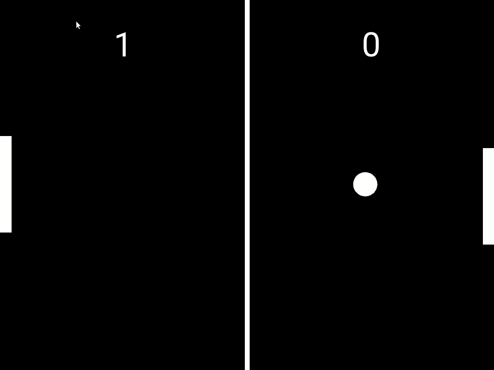
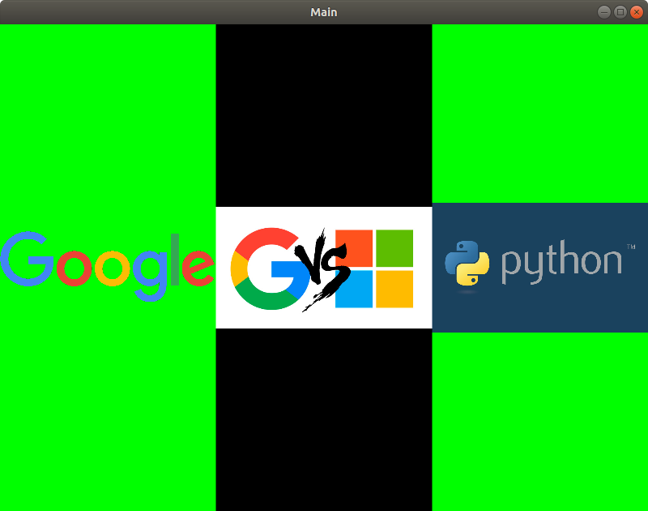

# PongAI_-_ExamplesKivy

This repository is created with the simple objective of learning the use of GUI in Python.

Multiple projects were done in order to achieve this purpose. All done by me following tutorials of kivy.

## Projects
1. Windows layout (Typical user login interface)
2. Pressing buttons (getting response from clicking)
3. Custom layout images
4. Pong game 
5. Pong game with AI
   
### Pong AI playing
Probably the most elaborated one. At the right side we have player 1, a bot that just follows the ball with a very low velocity in order to
be beatable by a human player. At the left side, the other bot was trained by a linear model (for simplicity reasons and not because of it
is in any way the best model in this scenario). The input of the model are the coordinates and velocity of the ball when it's crossing the
field from rigth to left and the desired output is the point where the ball hits the left wall.

#### Original Pong

#### With AI Pong

### Windows layout

### Pressing buttons

### Custom Layout images

